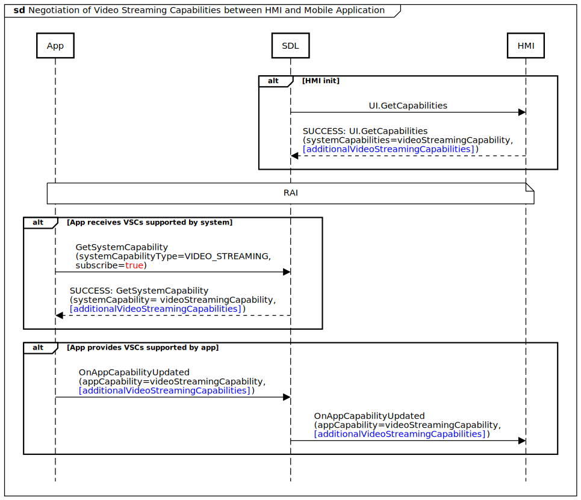
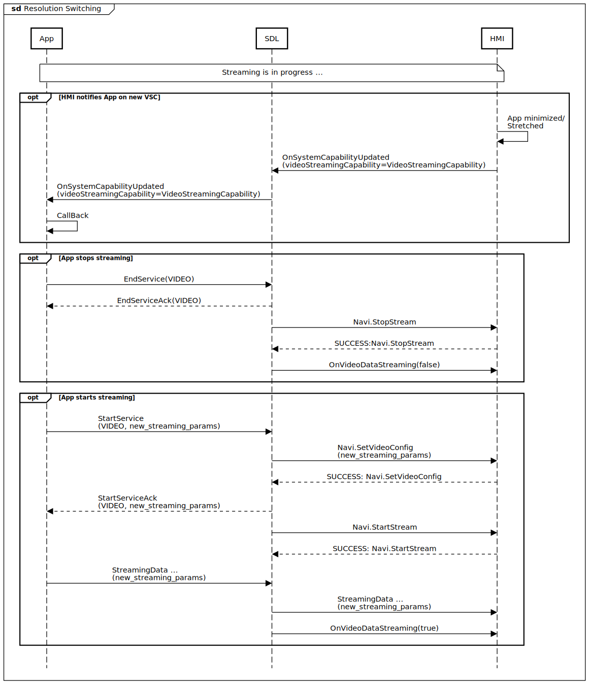

# Possibility to update video streaming capabilities during ignition cycle

* Proposal: [SDL-0296](0296-Update-video-streaming-capabilities-during-ignition-cycle.md)
* Author: [Dmytro Boltovskyi](https://github.com/dboltovskyi)
* Status: **In Review**
* Impacted Platforms: [Core / iOS / Java Suite]

## Introduction

The main purpose of this proposal is to make it possible to update video streaming capabilities (VSC) during the ignition cycle.

## Motivation

Currently there are numerous VSC parameters may be provided by HMI through SDL to Mobile application.
These may also include the ones described in [Pixel density and Scale](https://github.com/smartdevicelink/sdl_evolution/blob/master/proposals/0179-pixel-density-and-scale.md) proposal.
These parameters may be used by Projection or Navigation mobile application to properly adjust video streaming data.
Unfortunately, once these parameters defined during HMI initialization process, they can't be updated until the next ignition cycle.

This won't allow to implement use cases related to dynamic resolution switching, such as:
 - Picture-in-Picture
 - Preview
 - Split screen
 - Collapsed view

The idea of the proposal is to add such possibility into SDL ecosystem.

## Proposed solution

### SDL Core changes

#### Negotiation of VSCs

Available and supported VSCs needs to be negotiated between HMI and Mobile application.

1. HMI provides list of supported by system VSCs within new `additionalVideoStreamingCapabilities` parameter of `VideoStreamingCapability` struct in `UI.GetCapabilities` response:

```xml
<struct name="VideoStreamingCapability" since="4.5">
    <!-- Existing params -->
    <param name="additionalVideoStreamingCapabilities" type="VideoStreamingCapability" array="true" minvalue="1" maxvalue="100" mandatory="false" since="X.X">
    </param>
</struct>
```

2. Mobile application obtains these VSCs within `GetSystemCapability` request of `VIDEO_STREAMING` type.
Within this request mobile application also subscribes to receive VSC updates.

3. Mobile application provides supported by application VSCs within new `OnAppCapabilityUpdated` notification.

```xml
<function name="OnAppCapabilityUpdated" functionID="OnAppCapabilityUpdatedID" messagetype="notification" since="x.x">
    <description>A notification to inform SDL Core that a specific app capability has changed.</description>
    <param name="appCapability" type="AppCapability" mandatory="true">
        <description>The app capability that has been updated</description>
    </param>
</function>

<struct name="AppCapability" since="x.x">
    <param name="appCapabilityType" type="AppCapabilityType" mandatory="true">
        <description>Used as a descriptor of what data to expect in this struct. The corresponding param to this enum should be included and the only other param included.</description>
    </param>
    <param name="videoStreamingCapability" type="VideoStreamingCapability" mandatory="false">
        <description>Describes supported capabilities for video streaming </description>
    </param>
</struct>

<enum name="AppCapabilityType" since="x.x">
    <description>Enumerations of all available app capability types</description>
    <element name="VIDEO_STREAMING"/>
</enum>

<struct name="VideoStreamingCapability" since="4.5">
    <!-- Existing params -->
    <param name="additionalVideoStreamingCapabilities" type="VideoStreamingCapability" array="true" minvalue="1" maxvalue="100" mandatory="false" since="X.X">
    </param>
</struct>
```

Details on how mobile application selects supported VSCs described in [Mobile libraries changes](0296-Update-video-streaming-capabilities-during-ignition-cycle.md#mobile-libraries-changes-ios-and-android) section.

4. These VSCs transfered by SDL to HMI within the same new notification.



#### Resolution Switching

In order to notify Mobile application on current VSC HMI may use existing `OnSystemCapabilityUpdated` notification of `VIDEO_STREAMING` type.

Mobile application will receive such updates if it has been subscribed to them previously.



### Mobile libraries changes (iOS and Android)

#### Negotiation of VSCs

Mobile application has to provide back to HMI filtered list of supported VSCs based on the complete list provided by HMI.
This mechanism needs to be simplified for application developers.

The idea is to add some changes into Public API:
 - min/max aspect ratio
 - min/max resolution
 - minimum diagonalScreenSize

<ToDo: add more details on filtration logic>

**Examples**

**iOS**

In `SDLStreamingMediaConfiguration` class:

```objectivec
@property (strong, nonatomic, nullable) SDLSupportedStreamingRange *supportedLandscapeStreamingRange;
@property (strong, nonatomic, nullable) SDLSupportedStreamingRange *supportedPortraitStreamingRange;

@interface SDLSupportedStreamingRange : NSObject
// The minimum supported normalized aspect ratio, Min value is 1
@property (nonatomic, assign) float minimumAspectRatio;
// The maximum supported normalized aspect ratio, Min value is 1
@property (nonatomic, assign) float maximumAspectRatio;
// The minimum supported diagonal screen size in inches, defaults to 0 (0 matches any size)
@property (nonatomic, assign) float minimumDiagonal;
// The minimum resolution to support, it overrides .minimumAspectRatio
@property (nonatomic, assign) float minimumResolution;
// The maximum resolution to support, it overrides .maximumAspectRatio
@property (nonatomic, assign) float maximumResolution;
// Check if the argument is within the [.minimumResolution, .maximumResolution] range
- (BOOL)isImageResolutionInRange:(SDLImageResolution*)imageResolution;
// Check if the argument is within the [.minimumAspectRatio, .maximumAspectRatio] range
- (BOOL)isAspectRatioInRange:(float)aspectRatio;
<……>
@end
```

**Android**

In `SdlRemoteDisplay`:

```java
public abstract Integer getMinSupportedWidth();
public abstract Integer getMinSupportedHeight();
public abstract Integer getMaxSupportedWidth();
public abstract Integer getMaxSupportedHeight();
public abstract double getMinScreenDiagonal();
public abstract Double getMinAspectRatio();
public abstract Double getMaxAspectRatio();
```

In `SdlRemoteDisplay` implementation by mobile application developers:

```java
@Override
public Integer getMinSupportedWidth() {
  return 800;
}
@Override
public Integer getMinSupportedHeight() {
  return 600;
}
@Override
public Integer getMaxSupportedWidth() {
  return 1600;
}
@Override
public Integer getMaxSupportedHeight() {
  return 1200;
}
@Override
public double getMinScreenDiagonal() {
  return 6;
}
   @Override
   public Double getMinAspectRatio() {
     return 1.;
   }
   @Override
   public Double getMaxAspectRatio() {
     return 4.;
   }
```

#### Resolution Switching

Mobile applications should be able to update the streaming content window to the new VSCs received in `OnSystemCapabilityUpdated`.

SDL Manager shouldn't check and validate the VSC HMI sends to app to switch to.

<ToDo: add more details on callbacks>

### HMI Guidelines

If the change is a PIP-type change, scale the current video stream to the size you desire without going through this flow. Touches should never be passed to the app. Either a system menu/buttons should be displayed when selected, or the selection should bring the user immediately back to the full-screen app.

If the change is a split-screen type change (and cannot be handled by scaling the original video), then go through this flow. If the app does not support your custom split-resolution, either don't allow the user to put the app in split screen, or scale the video stream to a size that fits the window and use "black bars" to fill the rest of the window. Touches may be passed to the app in certain limited cases. (1) The window must have a width of at least 3" and a height of at least 3", (2) The touches must be offset for the developer so that 0,0 continues to be in the top-left corner of the app window. If these requirements are not met, either a system menu / buttons should be displayed when selected, or the selection should bring the user immediately back to the full-screen app.


## Potential downsides

The author was unable to identify any potential downsides.

## Impact on existing code

* SDL core needs to be updated to support described logic and new APIs.
* Java Suite and iOS proxy libraries would require updates related to dynamic resolution switching.
* HMI need to be updated to handle only supported VSCs received from Mobile application.

## Alternatives considered

1. Implement scaling of video frame completely at HMI. This approach has the following drawbacks:
  - aspect ratio remains the same
  - size of UI elements couldn't be adjusted for a smaller resolution and hence became unusable

